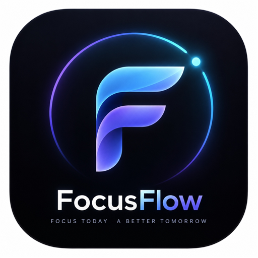
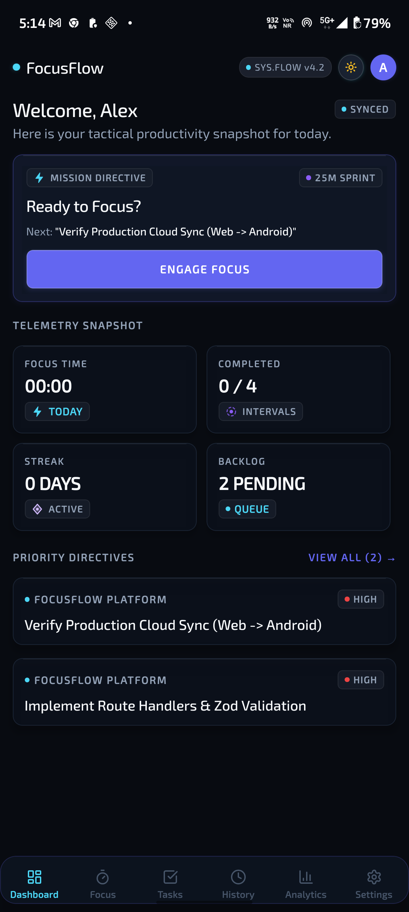
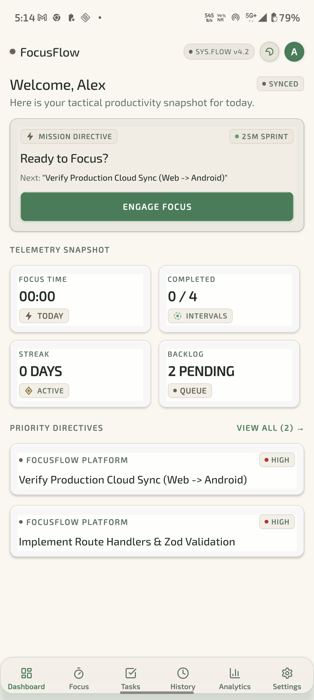
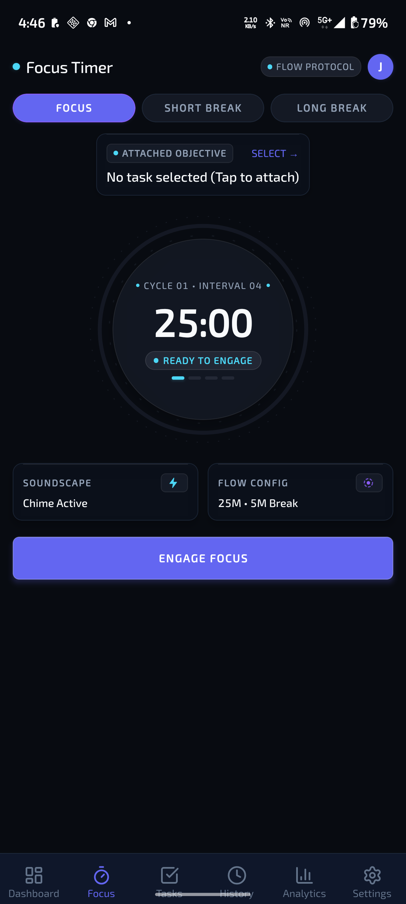
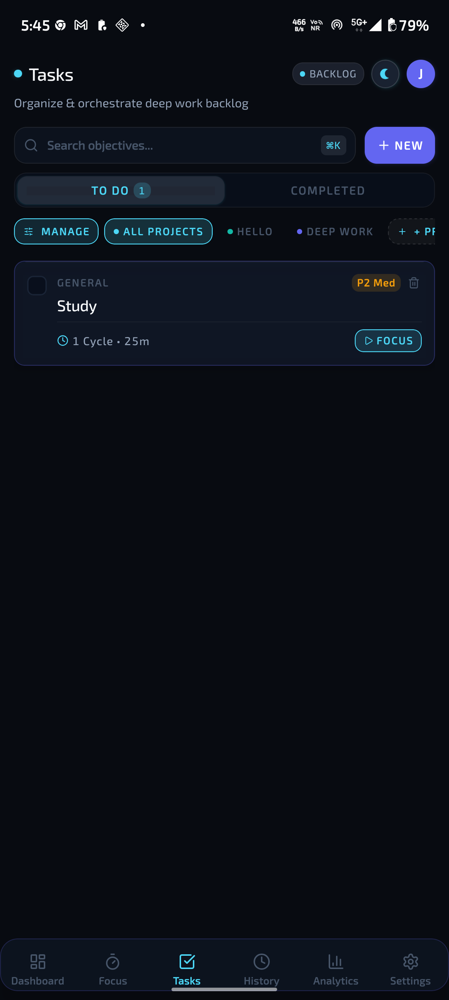
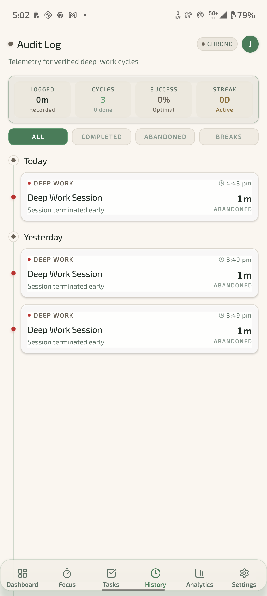
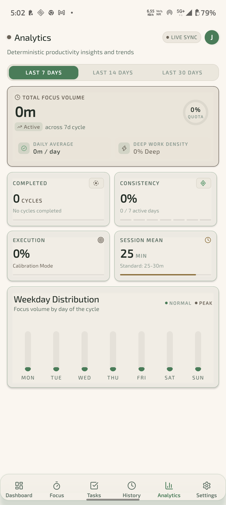
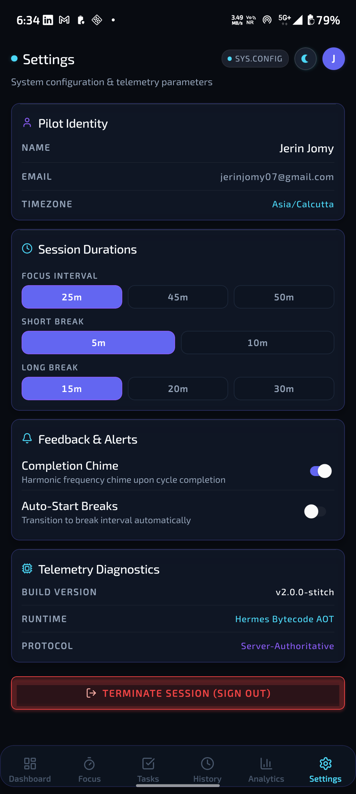
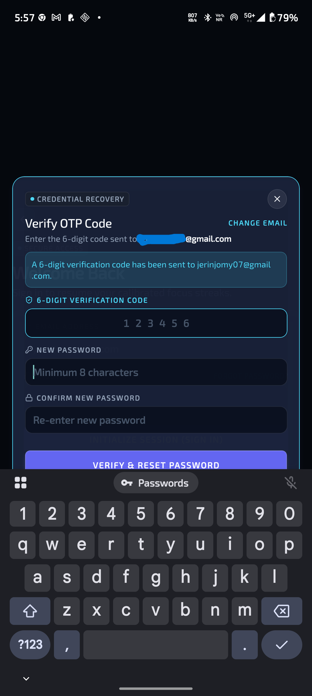
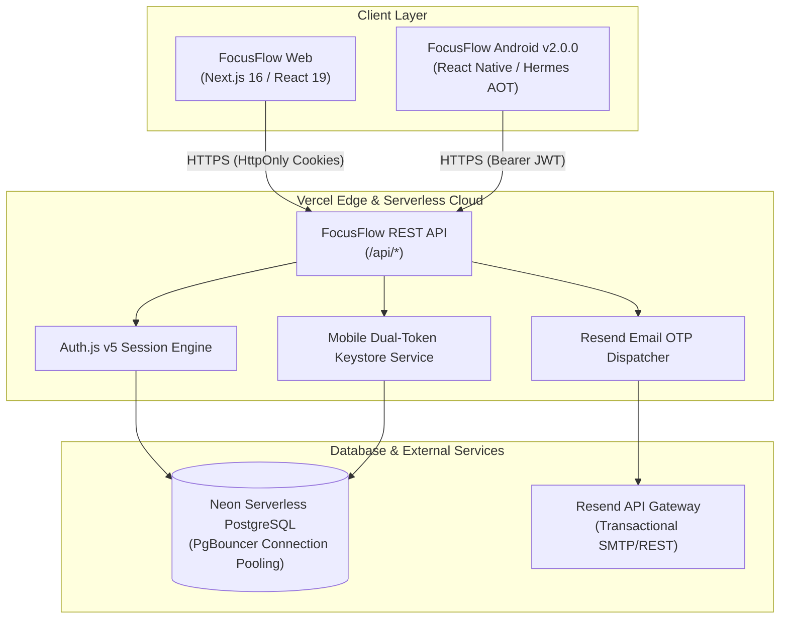

<div align="center">



# FocusFlow
### Focus Today, A Better Tomorrow
*Autonomous Kinetic Deep Work Ecosystem & Pure Standalone Android Application*

<p align="center">
  <a href="https://github.com/jerinjomy07/Focus-Flow/releases/latest"></a>
  <a href="https://github.com/jerinjomy07/Focus-Flow/releases/latest/download/FocusFlow-2.1.0-production.apk"></a>
  <a href="https://focusflow-app-red-gamma.vercel.app"></a>
  <a href="https://neon.tech"></a>
  <a href="LICENSE"></a>
</p>

<p align="center">
  <b>Android 16+ (SDK 36)</b> • <b>React Native 0.86 (Hermes AOT)</b> • <b>Next.js 16</b> • <b>Prisma ORM</b> • <b>Resend API</b>
</p>

</div>

---

## 📑 Table of Contents

- [📱 Download & Installation](#-download--installation)
- [🚀 What's New in v2.1.0](#-whats-new-in-v210)
- [📸 Screenshots Showcase](#-screenshots-showcase)
- [⚡ Key Highlights & Engineering](#-key-highlights--engineering)
- [🏗️ System Architecture & Data Flow](#️-system-architecture--data-flow)
- [📁 Directory Structure](#-directory-structure)
- [🛠️ Getting Started & Build Instructions](#️-getting-started--build-instructions)
- [📄 License & Credits](#-license--credits)

---

## 📱 Download & Installation

You can download and install the production-ready standalone Android APK directly on any Android device (Android 7.0+ / SDK 24 to 36):

| Package | Version | Download Link | Build Architecture | Size |
| :--- | :---: | :--- | :---: | :---: |
| 🤖 **FocusFlow Release APK** | `v2.1.0` | [**Download FocusFlow-2.1.0-production.apk**](https://github.com/jerinjomy07/Focus-Flow/releases/latest/download/FocusFlow-2.1.0-production.apk) | Universal (arm64-v8a, armeabi-v7a, x86_64) | ~59 MB |
| 📦 **Google Play Bundle** | `v2.1.0` | [**Download FocusFlow-2.1.0-production.aab**](https://github.com/jerinjomy07/Focus-Flow/releases/latest/download/FocusFlow-2.1.0-production.aab) | Android App Bundle (AAB) | ~41 MB |
| 🏷️ **GitHub Releases** | All | [**Browse Release Tags & Checksums**](https://github.com/jerinjomy07/Focus-Flow/releases) | Release Notes, Hashes & Assets | — |

> 💡 **Installation Tip**: After downloading the `.apk` on your mobile phone, tap the file and select *"Install from unknown sources"* if prompted. The application connects directly to the live cloud backend over 5G/4G/Wi-Fi with zero USB or PC connection required.

---

## 🌐 Live Web Application

FocusFlow operates a seamless cross-platform cloud experience deployed on **Vercel Serverless Platform** and connected to **Neon PostgreSQL**:

* **Production URL**: [https://focusflow-app-red-gamma.vercel.app](https://focusflow-app-red-gamma.vercel.app)
* **API Health Endpoint**: [https://focusflow-app-red-gamma.vercel.app/api/health](https://focusflow-app-red-gamma.vercel.app/api/health)
* **Demo Account**: `alex@focusflow.app`

---

## 🚀 What's New in v2.1.0

The **v2.1.0 Release** introduces a custom focus completion chime and alarm audio pipeline, zero-drift wall-clock background timer synchronization, custom session duration calibration, and hardened security diagnostics:

### 🔔 1. Special Timer Completion Ringtone & Alarm Pipeline
* **528Hz Zen Bell Chime**: Hand-crafted 16-bit 44.1kHz audio asset (`focusflow_alarm.wav`) tuned to the transformation Solfeggio frequency with rich harmonic acoustic decay (C5, G5, C6, E6).
* **Dedicated Android Alarm Notification Channel (`focusflow_timer_alarm_v2`)**: Configured at `IMPORTANCE_MAX` with `USAGE_ALARM` and tactile vibration sequencing (`[0, 500, 250, 500]`).
* **Foreground & Background Parity**: Sound plays reliably when the session finishes, whether in active view, backgrounded, or under screen lock. Respects `soundEnabled` user setting.

### ⏱️ 2. Zero-Drift Server-Authoritative Background Timer
* Instantaneous monotonic wall-clock reconciliation on foreground resumption without network refetch latency.
* Full idempotency across pause, resume, reset, and skip cycles.

### 🎛️ 3. Flexible Custom Duration Calibration
* Added dedicated `CUSTOM` duration inputs in Settings for Focus (1–120m), Short Break (1–60m), and Long Break (1–120m) while preserving standard preset intervals.

### 🛡️ 4. Hardened Password Reset Error Propagation
* HTTP 502 Bad Gateway with diagnostic payloads on Resend email delivery failure while preserving account enumeration protection.

The **v2.0.0 Major Release** delivers a futuristic aesthetic redesign, dynamic SVG theme animations, editable task project presets, hardened email OTP verification, and a refreshed visual brand identity.

### 🎨 1. Google Stitch UI Redesign (Obsidian Kinetic & Terra)
* **Obsidian Kinetic Mode**: Deep cosmic palette (`#080E1A`), glowing cyan accents (`#4CD7F6`), neon telemetry meters, and glassmorphic elevated panels.
* **Terra Mode**: Warm, refined earthen workspace theme (`#F8F6F0` and `#2D5A43`) offering high contrast for bright ambient environments.
* **SVG Morphing Theme Switcher**: Fluid animated morph between celestial Moon and radiant Sun icons on theme toggle.
* **Dedicated Quick-Toggle**: Accessible instant mode-switch icon in the header next to user avatar across all main navigation screens.

### 🏷️ 2. Editable Task Projects & Custom Preset Management
* **Dynamic Tag System**: Projects are no longer static — tags display real-time active filters and metadata.
* **Interactive `+` Preset Modal**: Pilots can create and register custom project presets directly from the Tasks screen.
* **Instant Project Assignment**: Tap preset chips to seamlessly assign tasks to custom work streams.

### 🔐 3. Real-Time Email OTP Password Reset
* **Hardened Security**: Replaced open password reset with cryptographic 6-digit One-Time Password (OTP) verification.
* **Vercel + Resend Integration**: Transactional email dispatch via Resend REST API (`onboarding@resend.dev`) delivering straight to Gmail inboxes with 10-minute expiry tokens.
* **2-Stage Modal Flow**:
  1. *Stage 1*: User submits email address to trigger verification dispatch.
  2. *Stage 2*: Centered 6-digit numeric input with letter spacing, new password & confirm fields, resend timer, and automatic sign-in upon verification.

### 💎 4. Brand New App Identity & Holographic Icon
* High-resolution holographic icon featuring an orbital luminous particle, gradient "F" glyph, and signature tagline *"Focus Today, A Better Tomorrow"*.
* Updated Android adaptive mipmap icons (`mipmap-{mdpi,hdpi,xhdpi,xxhdpi,xxxhdpi}`) and splash screens.

---

## 📸 Screenshots Showcase

Captured directly from a physical **Motorola Edge 60 Pro** (Android 16, SDK 36, 1220×2712 OLED):

<div align="center">

| 1. Obsidian Kinetic Dashboard | 2. Terra Workspace Theme |
|:---:|:---:|
|  |  |
| *Telemetry status, active focus streaks, & quick theme toggle* | *Warm daylight contrast with synchronized metrics* |

| 3. Monotonic Focus Timer | 4. Tasks & Custom Presets |
|:---:|:---:|
|  |  |
| *Zero-drift circular countdown with orbital particle glow* | *Deep work backlog with editable presets & modal creation* |

| 5. Chronological Audit History | 6. Telemetry & Analytics |
|:---:|:---:|
|  |  |
| *Detailed session history feed with timestamps and tags* | *Weekday distribution volume and productivity consistency* |

| 7. Diagnostics & Settings | 8. 2-Stage Email OTP Recovery |
|:---:|:---:|
|  |  |
| *Telemetry parameters, interval presets, & session control* | *Cryptographic 6-digit email OTP verification modal* |

</div>

---

## ⚡ Key Highlights & Engineering

### 1. ⏱️ Drift-Free Monotonic Timer Architecture
Conventional JavaScript `setInterval` loops suffer from progressive clock drift and OS background freezes. FocusFlow calculates remaining intervals using wall-clock target timestamps:

$$\text{remainingSeconds} = \max\left(0, \left\lfloor \frac{\text{targetEndTime} - \text{now}}{1000} \right\rfloor\right)$$

When paused, the exact frozen elapsed delta is preserved:

$$\text{pausedDuration} = \text{pausedDuration} + (\text{now} - \text{pausedAt})$$

Backgrounding the mobile application or locking the device produces **zero timer drift** upon return.

### 2. 🛡️ Enterprise Hardware-Backed Session Security
* **Android Keystore Encryption**: Mobile access tokens and rotating refresh tokens are securely encrypted at rest via `expo-secure-store`.
* **Short-Lived Access Tokens**: 15-minute cryptographically signed JWTs.
* **Refresh Token Rotation & Replay Protection**: Every token refresh revokes the prior token and generates a new pair linked to a stable `sessionFamilyId`. Replaying an expired token immediately revokes all family sessions across devices.

### 3. ☁️ Unified Cross-Platform Synchronization
* Single source of truth via **Neon Serverless PostgreSQL** and **Prisma ORM**.
* Real-time session state synchronization across Next.js 16 Web clients and React Native mobile devices.
* Harmonic audio completion chimes via native audio decoders.

---

## 🏗️ System Architecture & Data Flow



---

## 📁 Directory Structure

```text
FocusFlow/
├── .github/
│   └── workflows/
│       └── release.yml                 # Automated APK/AAB build & GitHub Release
├── docs/                               # Engineering documentation & media
│   ├── assets/
│   │   └── app_icon.png                # Master 512x512 application brand icon
│   └── screenshots/                    # High-resolution physical device captures
│       ├── 01_dashboard_obsidian.png
│       ├── 02_dashboard_terra.png
│       ├── 03_focus_timer.png
│       ├── 04_tasks_presets.png
│       ├── 05_history_audit.png
│       ├── 06_analytics_insights.png
│       ├── 07_settings_preferences.png
│       └── 08_otp_recovery.png
├── focusflow-app/                      # Next.js 16 Cloud Web & API Backend
│   ├── prisma/
│   │   ├── schema.prisma               # Database model definitions
│   │   └── seed.ts                     # Database seeder
│   ├── src/
│   │   ├── app/                        # App router (pages, drawers, & API routes)
│   │   ├── lib/email.ts                # Resend OTP transactional mail service
│   │   └── lib/auth/                   # Dedicated mobile & web session handlers
│   └── package.json                    # v2.1.0
├── mobile/                             # Pure Standalone React Native + Expo App
│   ├── android/                        # Android native project (Gradle / ProGuard)
│   │   └── app/src/main/res/           # Native mipmap launcher icons & colors
│   ├── assets/                         # App icon, adaptive foregrounds, & splash
│   ├── src/
│   │   ├── api/                        # Typed REST API client with auto-rotation
│   │   ├── context/                    # AuthContext & ThemeContext
│   │   ├── screens/                    # Stitch Dashboard, Focus, Tasks, History, Settings
│   │   └── services/                   # Drift-free timer & harmonic audio chimes
│   ├── app.json                        # Application manifest (v2.1.0, versionCode 3)
│   └── package.json                    # v2.1.0
├── release/                            # Distribution binaries & checksums
└── README.md                           # Modern project showcase
```

---

## 🛠️ Getting Started & Build Instructions

### Prerequisites
* **Node.js**: `v20.x` or `v22.x`
* **Java Development Kit**: JDK 17
* **Android SDK**: Build Tools 36.0.0, Platform SDK 36
* **Database**: PostgreSQL (Local or Neon)

### 1. Web Application & API Setup
```bash
cd focusflow-app
npm install
cp .env.example .env

# Run migrations & seed data
npx prisma migrate deploy
npx prisma db seed

# Launch local dev server
npm run dev
```
Open [http://localhost:3000](http://localhost:3000) to view the web dashboard.

### 2. Mobile Application Build (Release APK v2.1.0)
```bash
cd mobile
npm install

# Run TypeScript check & unit tests
npm run type-check
npm test

# Build production standalone APK locally
cd android
./gradlew assembleRelease --no-daemon --console=plain
```
The compiled APK will be output to:
`mobile/android/app/build/outputs/apk/release/app-release.apk`

---

## 📄 License & Credits

This project is open-source software licensed under the [MIT License](LICENSE).

Copyright © 2026 Jerin Jomy & FocusFlow Contributors.
