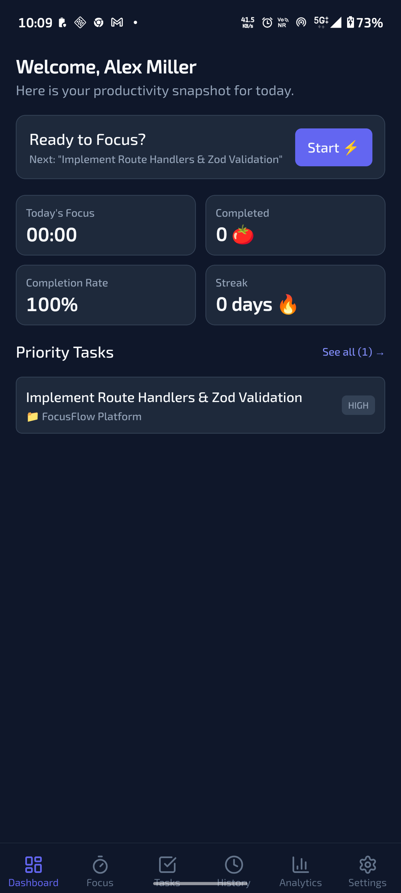
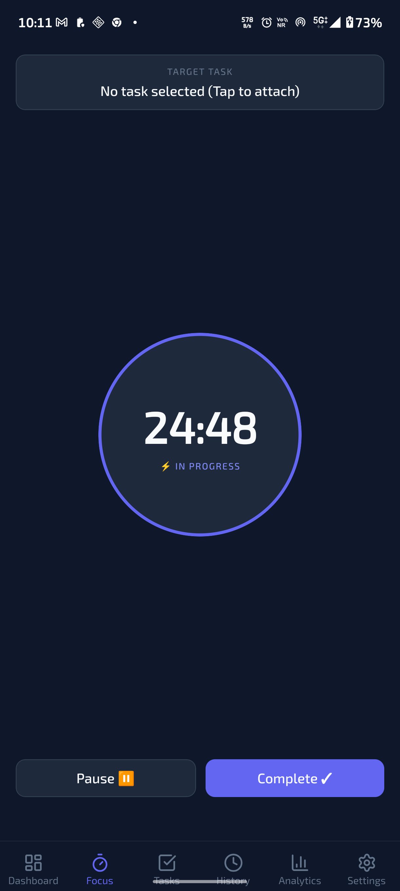
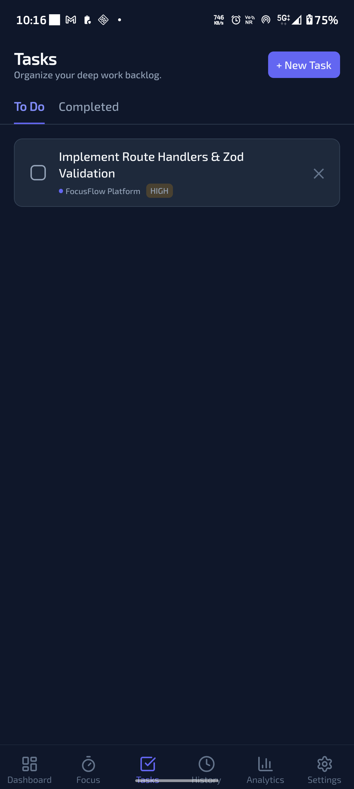
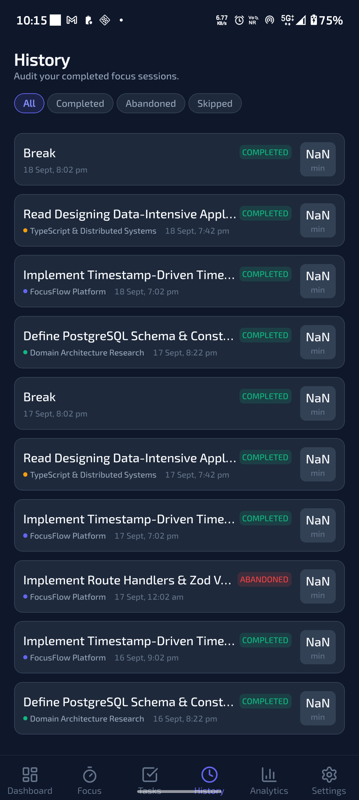
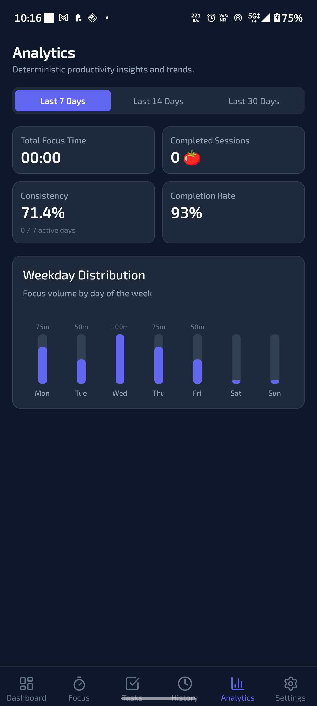
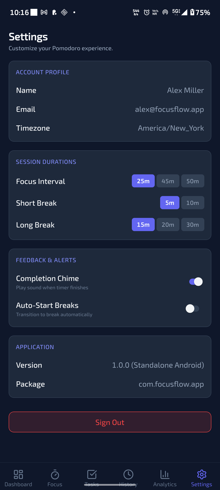
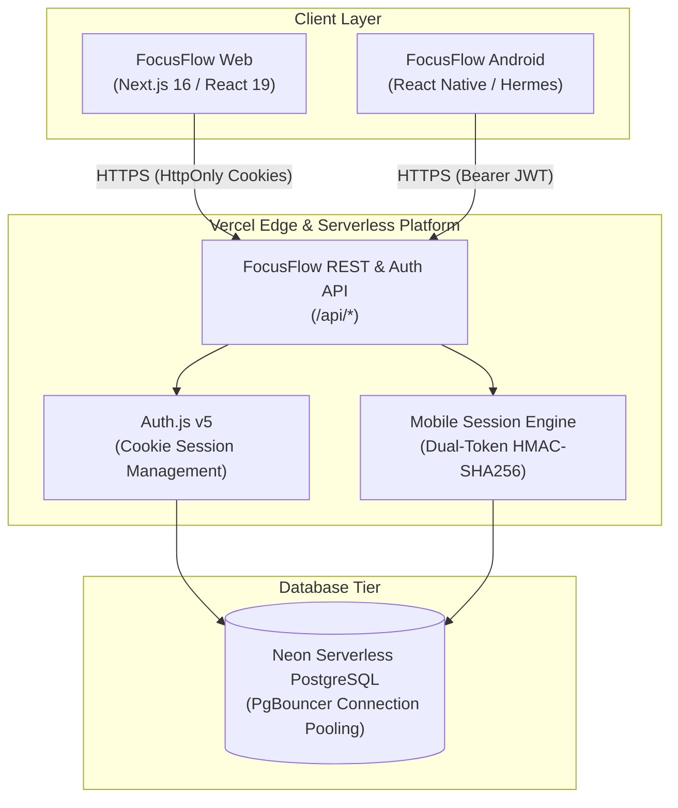

<div align="center">

# ? FocusFlow
### Modern Full-Stack Deep Work Platform & Standalone Android App

[](https://github.com/jerinjomy07/Focus-Flow/releases/latest)
[](https://github.com/jerinjomy07/Focus-Flow/releases/latest/download/FocusFlow-1.0.0-production.apk)
[](https://focusflow-app-red-gamma.vercel.app)
[](https://neon.tech)
[](LICENSE)

*A professional, cross-platform productivity ecosystem combining a Next.js 16 cloud web application with a pure standalone React Native + Expo Android application — powered by managed Neon PostgreSQL and zero-drift timestamp timer architecture.*

</div>

---

## ?? Download & Test the Mobile App (APK)

You can download the production-ready Android APK directly and test it on any physical Android device (Android 7.0+ / SDK 24 to 36):

| Asset | Version | Direct Download Link | Description |
| :--- | :---: | :--- | :--- |
| ?? **FocusFlow APK** | `v1.0.0` | [**Download FocusFlow-1.0.0-production.apk**](https://github.com/jerinjomy07/Focus-Flow/releases/latest/download/FocusFlow-1.0.0-production.apk) | Standalone release build with Hermes bytecode & ProGuard minification |
| ?? **Google Play Bundle** | `v1.0.0` | [**Download FocusFlow-1.0.0-production.aab**](https://github.com/jerinjomy07/Focus-Flow/releases/latest/download/FocusFlow-1.0.0-production.aab) | Optimized Android App Bundle for Google Play Store publishing |
| ??? **All Releases** | Any | [**Browse All Versions & Checksums**](https://github.com/jerinjomy07/Focus-Flow/releases) | Version history, SHA-256 signatures, and detailed changelogs |

> ?? **Installation Tip**: After downloading on your Android phone, tap the `.apk` file and allow *"Install from unknown sources"* if prompted. The app connects directly to the live cloud over 5G/4G/Wi-Fi with zero USB or PC connection required.

---

## ?? Live Web Application

The web version of FocusFlow is continuously deployed on the **Vercel Serverless Platform** and connected to **Neon Serverless PostgreSQL**:

* **Production URL**: [https://focusflow-app-red-gamma.vercel.app](https://focusflow-app-red-gamma.vercel.app)
* **Production Health API**: [https://focusflow-app-red-gamma.vercel.app/api/health](https://focusflow-app-red-gamma.vercel.app/api/health)
* **Demo Credentials**:
  * **Email**: `alex@focusflow.app`
  * **Password**: `password123`

---

## ?? Screenshots Showcase (Physical Android Device)

Tested and captured directly on a physical **Motorola Edge 60 Pro** (Android 16, SDK 36):

<div align="center">

| 1. Dashboard | 2. Focus Timer |
|:---:|:---:|
|  |  |
| *Productivity snapshot, active streaks, & priority tasks* | *Drift-free circular countdown with play/pause controls* |

| 3. Deep Work Tasks | 4. Session History |
|:---:|:---:|
|  |  |
| *Organize backlog with priority filters & status tabs* | *Chronological audit feed with timestamps & tags* |

| 5. Analytics & Trends | 6. Settings & Preferences |
|:---:|:---:|
|  |  |
| *Weekday focus volume distribution & consistency metrics* | *Session interval presets, feedback chimes, & sign out* |

</div>

---

## ?? Key Highlights & Engineering Features

### 1. ? Pure Standalone React Native + Expo Client
* **Genuine Native Binary**: Compiled directly to Android bytecode using the **Hermes V12** JavaScript engine.
* **No WebViews or Wrappers**: 100% native UI components, native animations, and native navigation tabs rendering at 120Hz.
* **ProGuard Obfuscation & Tree-Shaking**: Production APK size optimized to 68.3 MB with complete dead-code elimination.

### 2. ?? Drift-Free Timestamp-Driven Timer Engine
* **The Problem**: Conventional `setInterval` loops drift by seconds or halt entirely when mobile OS power managers sleep background processes.
* **The Solution**: FocusFlow calculates all elapsed intervals using monotonic wall-clock target timestamps:
  $$\text{remainingSeconds} = \max\left(0, \left\lfloor \frac{\text{targetEndTime} - \text{now}}{1000} \right\rfloor\right)$$
* When paused, the exact frozen delta is persisted:
  $$\text{pausedDuration} = \text{pausedDuration} + (\text{now} - \text{pausedAt})$$
* Backgrounding the application for 30–60 seconds produces **zero timer drift** upon foreground return.

### 3. ?? Enterprise Mobile Dual-Token Session Architecture
* **Hardware-Backed Keystore**: Mobile access tokens and rotating refresh tokens are stored securely in Android Keystore via `expo-secure-store`.
* **Short-Lived Access Tokens**: 15-minute cryptographically signed JWTs.
* **Refresh Token Rotation & Replay Detection**:
  * Every refresh operation invalidates the previous refresh token and issues a new token pair.
  * Uses a stable `sessionFamilyId`. If an already-rotated token is presented again (replay attack), the entire session family is instantly revoked.

### 4. ?? Real-Time Cross-Platform Cloud Synchronization
* Unified database schema across Web and Mobile via **Prisma ORM** on **Neon PostgreSQL**.
* Create a task on your laptop browser, and it appears instantly on your mobile app.
* Complete a Pomodoro session on your phone, and it immediately reflects in your desktop productivity analytics.

---

## ??? System Architecture & Data Flow



---

## ?? Project Directory Structure

```text
FocusFlow/
+-- .github/
¦   +-- workflows/
¦       +-- release.yml                 # Automated APK/AAB build & GitHub Release
+-- focusflow-app/                      # Next.js 16 Full-Stack Web & API Backend
¦   +-- prisma/
¦   ¦   +-- migrations/                 # Committed Prisma migration history
¦   ¦   +-- schema.prisma               # Database model definitions
¦   ¦   +-- seed.ts                     # Database seeder
¦   +-- src/
¦   ¦   +-- app/                        # Next.js App Router (pages & API routes)
¦   ¦   +-- lib/auth/                   # Dedicated mobile & web session handlers
¦   ¦   +-- components/                 # React UI component library
¦   +-- vercel.json                     # Vercel deployment specification
+-- mobile/                             # Pure Standalone React Native + Expo App
¦   +-- android/                        # Android native project (Gradle / ProGuard)
¦   +-- src/
¦   ¦   +-- api/                        # Typed REST API client with auto-rotation
¦   ¦   +-- context/                    # Hardware-backed AuthContext
¦   ¦   +-- screens/                    # Dashboard, Focus, Tasks, History, Analytics
¦   ¦   +-- services/                   # Drift-free timer engine & audio haptics
¦   +-- app.json                        # Expo application manifest
+-- release/                            # Production distribution binaries
¦   +-- FocusFlow-1.0.0-production.apk  # Standalone Release APK (68.3 MB)
¦   +-- FocusFlow-1.0.0-production.aab  # Production Google Play Bundle (47.2 MB)
¦   +-- RELEASE_CHECKSUMS.txt           # SHA-256 verified signatures
¦   +-- PRODUCTION_RELEASE_NOTES.md     # Production changelog
+-- docs/                               # Engineering documentation & screenshots
¦   +-- screenshots/                    # Physical device screenshots
+-- LICENSE                             # MIT License
+-- README.md                           # Project showcase & documentation
```

---

## ?? Getting Started & Local Development

### Prerequisites
* **Node.js**: `v20.x` or `v22.x`
* **Java Development Kit**: JDK 17
* **Android SDK**: Build Tools 36.0.0, Platform SDK 36
* **Database**: PostgreSQL (Local or Neon)

### 1. Web Application & Backend Setup
```bash
cd focusflow-app
npm install
cp .env.example .env

# Apply database migrations & seed initial data
npx prisma migrate deploy
npx prisma db seed

# Start development server
npm run dev
```
Open [http://localhost:3000](http://localhost:3000) to view the web dashboard.

### 2. Mobile Application Setup
```bash
cd mobile
npm install

# Run tests
npm test

# Build production release APK locally
cd android
./gradlew assembleRelease --no-daemon --console=plain
```
The compiled APK will be located at `mobile/android/app/build/outputs/apk/release/app-release.apk`.

---

## ?? License

This project is open-source software licensed under the [MIT License](LICENSE).

Copyright © 2026 Jerin Jomy & FocusFlow Contributors.
