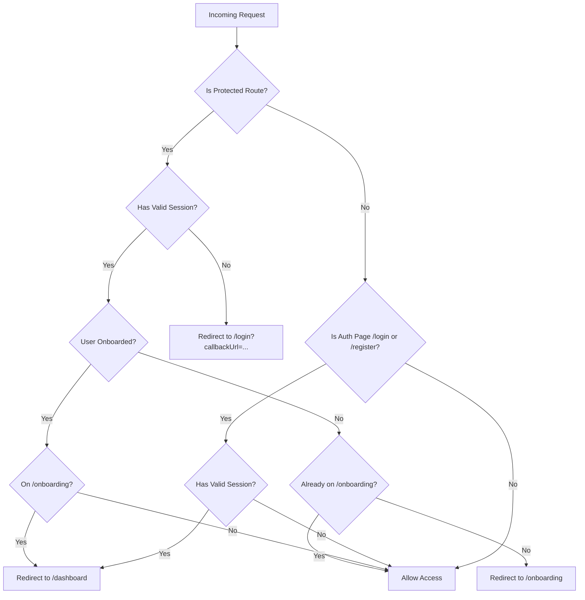

# FocusFlow — Authentication & Identity Architecture

**Version:** 1.0.0 (Phase 4 — Authentication & Onboarding)  
**Date:** 2026-09-17  
**Status:** Implemented & Verified Specification  

---

## 1. Overview & Identity Strategy

FocusFlow is a multi-user productivity SaaS platform where each user's data (tasks, projects, focus sessions, timer preferences, goals, and analytics) is strictly isolated to their own tenant account.

Authentication and identity management are implemented using **Auth.js v5 (NextAuth v5 beta)** paired with local credential verification using **bcryptjs**.

### Key Architectural Tenets
1. **Zero Trust Client**: The client is never trusted for identity or authorization. All identity claims originate from cryptographically signed server tokens.
2. **Server-Side Authorization**: Every API route handler and database operation resolves the authenticated user via `session.user.id` on the server.
3. **Anti-Enumeration Security**: Authentication and resource access endpoints avoid leaking information about user accounts or existing IDs.
4. **Resilient Session Management**: 30-day sliding JWT sessions with client session enrichment for responsive UI updates.

---

## 2. Technology Selection & Rationale

| Layer | Selection | Rationale |
| :--- | :--- | :--- |
| **Auth Framework** | Auth.js v5 (`next-auth@5.0.0-beta.25`) | Standard Next.js App Router identity framework; clean integration with middleware, route handlers, and React Server Components. |
| **Provider** | `Credentials` | Custom email/password credentials provider backed by Prisma and PostgreSQL. |
| **Password Hashing** | `bcryptjs` (Cost: 12 rounds) | Robust salted key derivation function mitigating rainbow tables and brute force attacks. |
| **Session Model** | JWT sliding session (`maxAge: 30 days`) | Stateless, horizontally scalable session validation at the edge and in Route Handlers without per-request database lookups. |
| **Validation** | Zod (`RegisterSchema`, `LoginSchema`) | Runtime schema validation and sanitization prior to database or authentication execution. |

*Reference: [ADR-002: Auth.js v5 over Clerk](file:///c:/Users/jerin/OneDrive/Documents/CHATGPT%20CODEX/Focus%20Flow/docs/decisions/ADR-002-authjs-over-clerk.md)*

---

## 3. Password Security & Policy

### 3.1 Hashing & Verification
- **Salt Rounds:** `12` (`bcrypt.hash(password, 12)`).
- **Plaintext Passwords:** Plaintext passwords are never logged, cached, transmitted in responses, or held in memory beyond the scope of verification.
- **Timing Attacks:** `bcrypt.compare` executes in constant time relative to password length, preventing side-channel timing analysis.

### 3.2 Password Complexity Rules
Enforced in `RegisterSchema` (`src/lib/validations/index.ts`):
- **Minimum length:** 8 characters.
- **Maximum length:** 128 characters (mitigating denial-of-service via computationally expensive password hashing on unbounded input strings).

### 3.3 Anti-Enumeration Policy
- In `/api/auth/register`, duplicate emails return HTTP `409 Conflict` with error code `EMAIL_ALREADY_EXISTS`.
- In `/login` (`authorize` callback), invalid emails and invalid passwords return identical generic error messages: `"Invalid email address or password. Please try again."`
- Unauthorized attempts to access another user's task or project return HTTP `404 Not Found` rather than `403 Forbidden` to prevent resource identifier enumeration.

---

## 4. Session Architecture & Token Claims

### 4.1 JWT Session Configuration
Auth.js is configured in `src/lib/auth/index.ts` with:
```typescript
session: {
  strategy: 'jwt',
  maxAge: 30 * 24 * 60 * 60, // 30 days sliding session
}
```

### 4.2 Token & Session Enrichment
The `jwt` and `session` callbacks augment default NextAuth tokens with FocusFlow domain attributes:

```typescript
callbacks: {
  async jwt({ token, user, trigger, session }) {
    if (user) {
      token.id = user.id;
      token.timezone = (user as any).timezone ?? 'UTC';
      token.onboardedAt = (user as any).onboardedAt ?? null;
    }

    if (trigger === 'update' && session) {
      if (session.user?.name !== undefined) token.name = session.user.name;
      if (session.user?.timezone !== undefined) token.timezone = session.user.timezone;
      if (session.user?.onboardedAt !== undefined) token.onboardedAt = session.user.onboardedAt;
    }

    return token;
  },
  async session({ session, token }) {
    if (token && session.user) {
      session.user.id = token.id as string;
      session.user.timezone = (token.timezone as string) ?? 'UTC';
      session.user.onboardedAt = (token.onboardedAt as string | null) ?? null;
    }
    return session;
  },
}
```

### 4.3 TypeScript Augmentation
Module augmentation in `src/types/next-auth.d.ts` guarantees type safety across `auth()`, `useSession()`, and NextAuth callbacks:
```typescript
declare module 'next-auth' {
  interface User {
    id: string;
    timezone: string;
    onboardedAt?: string | null;
  }
  interface Session {
    user: {
      id: string;
      email: string;
      name?: string | null;
      image?: string | null;
      timezone: string;
      onboardedAt?: string | null;
    };
  }
}
```

---

## 5. API Endpoints Specification

### 5.1 Registration: `POST /api/auth/register`
- **Access:** Public
- **Request Body:**
  ```json
  {
    "name": "Jane Doe",
    "email": "jane@example.com",
    "password": "strongPassword123"
  }
  ```
- **Execution:**
  1. Validates payload via `RegisterSchema`.
  2. Normalizes email: `email.toLowerCase().trim()`.
  3. Checks email uniqueness against PostgreSQL; returns `409 Conflict` if existing.
  4. Hashes password via `bcrypt.hash(password, 12)`.
  5. Atomically creates `User` and default `UserSettings` in database transaction.
  6. Returns `201 Created` with sanitized user object (password hash excluded).

### 5.2 Current User: `GET /api/users/me`
- **Access:** Authenticated (Bearer session cookie)
- **Response:**
  ```json
  {
    "data": {
      "id": "cuid_...",
      "name": "Jane Doe",
      "email": "jane@example.com",
      "image": null,
      "timezone": "America/New_York",
      "onboardedAt": "2026-09-17T02:00:00.000Z",
      "createdAt": "2026-09-17T01:50:00.000Z",
      "updatedAt": "2026-09-17T02:00:00.000Z"
    }
  }
  ```

### 5.3 Profile Update: `PATCH /api/users/me`
- **Access:** Authenticated
- **Request Body:**
  ```json
  {
    "name": "Jane Smith",
    "timezone": "Europe/Paris"
  }
  ```
- **Validation:** Validated against `UpdateUserSchema`. Validates valid IANA timezone string if provided.

### 5.4 Settings: `GET /api/settings` & `PATCH /api/settings`
- **Access:** Authenticated
- **Fetches / updates:** `focusDuration`, `shortBreakDuration`, `longBreakDuration`, `sessionsBeforeLongBreak`, `autoStartBreaks`, `autoStartFocus`, `soundEnabled`, `notificationsEnabled`, `theme`.
- **Validation:** Strict range bounds (e.g. `focusDuration`: 1..120 min, `sessionsBeforeLongBreak`: 1..10).

---

## 6. Route Protection & Middleware Policy

The Next.js middleware (`src/middleware.ts`) monitors inbound requests and enforces route guards:



### Protected Routes
- `/dashboard`
- `/focus`
- `/tasks`
- `/projects`
- `/analytics`
- `/settings`
- `/onboarding` (requires authentication)

---

## 7. Verification & Automated Testing

The authentication subsystem is covered by automated unit tests in `src/lib/auth/__tests__/auth.test.ts`:
- **Bcrypt Security:** Confirms cost 12 prefix `$2a$12$` / `$2b$12$` and accurate cryptographic verification.
- **RegisterSchema:** Tests whitespace trimming, email lowercasing, minimum 8 characters, maximum 128 characters, and invalid email rejection.
- **LoginSchema:** Validates required credentials and email format.
- **JWT & Session Callbacks:** Verifies correct field propagation, claim updates on session trigger `update`, and sanitized session structure.
