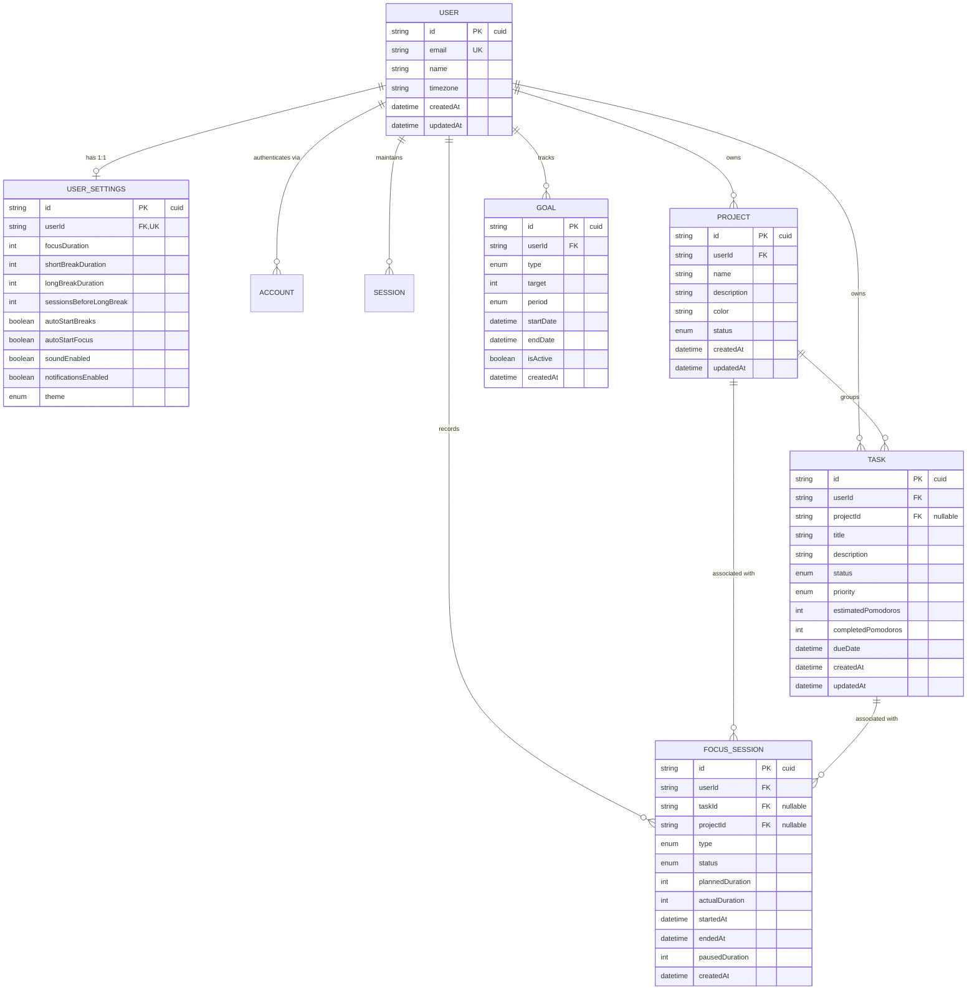

# FocusFlow — Database Architecture

**Version:** 1.0.0 (Phase 1 — Technical Foundation)  
**Date:** 2026-09-17  
**Status:** Approved Architectural Specification  

---

## 1. Database Architecture & Design Principles

FocusFlow uses **PostgreSQL** as its relational persistence engine managed via **Prisma ORM**. The data tier enforces strict ACID guarantees, multi-tenant isolation, referential integrity, and performant query indexing.

### 1.1 Guiding Principles
1. **Multi-User Isolation by Design:** Every tenant-specific table contains an indexed `userId` column referencing `User.id`. No query across tenant boundaries is permitted.
2. **UTC Timestamp Uniformity:** All temporal values (`DateTime`) are stored in Coordinated Universal Time (UTC). Local timezone rendering and day-boundary grouping occur strictly in the application domain.
3. **No Phantom Counters:** Statistics (e.g. today's focus minutes, streak counts, project breakdown) are derived on-the-fly via indexed aggregation queries. The single exception is `Task.completedPomodoros`, which is persisted directly on the task to ensure fast list rendering without joining across tens of thousands of session rows.
4. **Referential Integrity & Safe Deletion Cascades:** Foreign keys explicitly define `ON DELETE CASCADE` or `ON DELETE SET NULL` to prevent orphaned records while preserving audit history.
5. **Deterministic Identifiers:** Primary keys utilize collision-resistant alphanumeric IDs (`cuid()`), avoiding guessable auto-increment sequences while maintaining index locality.

---

## 2. Entity Relationship Diagram (ERD)



---

## 3. Schema Specifications & Column Details

### 3.1 `User`
The root identity entity for the platform.

| Column | Type | Constraints | Description |
|---|---|---|---|
| `id` | String | PK, `@default(cuid())` | Unique system identifier |
| `name` | String? | Nullable | User display name |
| `email` | String | Unique, Indexed | Normalized lowercase email address |
| `emailVerified` | DateTime? | Nullable | Email confirmation timestamp |
| `passwordHash` | String? | Nullable | Bcrypt hash ($2b$12$) for credentials auth |
| `image` | String? | Nullable | Avatar image URL |
| `timezone` | String | `@default("UTC")` | IANA timezone string (e.g. `America/New_York`, `Asia/Kolkata`) |
| `createdAt` | DateTime | `@default(now())` | Registration timestamp |
| `updatedAt` | DateTime | `@updatedAt` | Auto-updating modification timestamp |

### 3.2 `UserSettings`
One-to-one preferences profile for timer, notifications, and appearance.

| Column | Type | Constraints | Description |
|---|---|---|---|
| `id` | String | PK, `@default(cuid())` | Unique identifier |
| `userId` | String | FK, Unique, Indexed | References `User(id)` ON DELETE CASCADE |
| `focusDuration` | Int | `@default(25)` | Planned focus time in minutes (1–120) |
| `shortBreakDuration` | Int | `@default(5)` | Short break duration in minutes (1–60) |
| `longBreakDuration` | Int | `@default(15)` | Long break duration in minutes (1–120) |
| `sessionsBeforeLongBreak` | Int | `@default(4)` | Focus sessions count required before long break (1–10) |
| `autoStartBreaks` | Boolean | `@default(false)` | Automatically transition into break when focus ends |
| `autoStartFocus` | Boolean | `@default(false)` | Automatically transition into focus when break ends |
| `soundEnabled` | Boolean | `@default(true)` | Auditory chimes on timer completion |
| `notificationsEnabled` | Boolean | `@default(true)` | Web Push/Browser desktop notifications |
| `theme` | Enum `Theme` | `@default(SYSTEM)` | `LIGHT`, `DARK`, or `SYSTEM` |
| `createdAt` | DateTime | `@default(now())` | Creation timestamp |
| `updatedAt` | DateTime | `@updatedAt` | Modification timestamp |

### 3.3 `Project`
Organizational container for categorizing tasks and focus investments.

| Column | Type | Constraints | Description |
|---|---|---|---|
| `id` | String | PK, `@default(cuid())` | Unique identifier |
| `userId` | String | FK, Indexed | References `User(id)` ON DELETE CASCADE |
| `name` | String | Length(1..100) | Project title |
| `description` | String? | Length(..500) | Optional contextual notes |
| `color` | String | `@default("#6366f1")` | Hex color code for UI badges and charts |
| `status` | Enum `ProjectStatus` | `@default(ACTIVE)` | `ACTIVE`, `ARCHIVED` |
| `createdAt` | DateTime | `@default(now())` | Creation timestamp |
| `updatedAt` | DateTime | `@updatedAt` | Modification timestamp |

### 3.4 `Task`
Actionable unit of work that can be prioritized, estimated, and assigned to focus sessions.

| Column | Type | Constraints | Description |
|---|---|---|---|
| `id` | String | PK, `@default(cuid())` | Unique identifier |
| `userId` | String | FK, Indexed | References `User(id)` ON DELETE CASCADE |
| `projectId` | String? | FK, Indexed, Nullable | References `Project(id)` ON DELETE SET NULL |
| `title` | String | Length(1..200) | Task title |
| `description` | String? | Length(..2000) | Markdown/text notes |
| `status` | Enum `TaskStatus` | `@default(TODO)` | `TODO`, `IN_PROGRESS`, `COMPLETED` |
| `priority` | Enum `Priority` | `@default(MEDIUM)` | `LOW`, `MEDIUM`, `HIGH`, `URGENT` |
| `estimatedPomodoros`| Int? | Nullable, Min(1), Max(50) | Estimated number of 25m sessions |
| `completedPomodoros`| Int | `@default(0)` | Incremented upon each COMPLETED focus session |
| `dueDate` | DateTime? | Nullable, Indexed | Due date (stored in UTC) |
| `createdAt` | DateTime | `@default(now())` | Creation timestamp |
| `updatedAt` | DateTime | `@updatedAt` | Modification timestamp |

### 3.5 `FocusSession`
The immutable ledger of all timer executions. Source of truth for all productivity analytics.

| Column | Type | Constraints | Description |
|---|---|---|---|
| `id` | String | PK, `@default(cuid())` | Unique identifier |
| `userId` | String | FK, Indexed | References `User(id)` ON DELETE CASCADE |
| `taskId` | String? | FK, Indexed, Nullable | References `Task(id)` ON DELETE SET NULL |
| `projectId` | String? | FK, Indexed, Nullable | References `Project(id)` ON DELETE SET NULL (Denormalized) |
| `type` | Enum `SessionType` | Not Null | `FOCUS`, `SHORT_BREAK`, `LONG_BREAK` |
| `status` | Enum `SessionStatus`| `@default(IN_PROGRESS)` | `IN_PROGRESS`, `COMPLETED`, `ABANDONED`, `SKIPPED` |
| `plannedDuration` | Int | Not Null | Planned length in seconds (e.g. 1500 for 25m) |
| `actualDuration` | Int? | Nullable | Measured productive duration in seconds |
| `startedAt` | DateTime | Not Null, Indexed | UTC start timestamp |
| `endedAt` | DateTime? | Nullable | UTC completion/abandonment timestamp |
| `pausedAt` | DateTime? | Nullable | UTC timestamp when paused, null when running |
| `pausedDuration` | Int | `@default(0)` | Total accumulated pause duration in seconds |
| `createdAt` | DateTime | `@default(now())` | Record insertion timestamp |

*Denormalization Rationale for `projectId`:* Focus sessions can be linked directly to a project even if no specific task is assigned (e.g. "General Architecture Research" under Project "FocusFlow"). Additionally, copying `projectId` onto the session allows single-table analytical queries (e.g. "Focus time grouped by project") without requiring an expensive SQL join against `Task`.

### 3.6 `Goal`
Daily or weekly productivity targets set by the user.

| Column | Type | Constraints | Description |
|---|---|---|---|
| `id` | String | PK, `@default(cuid())` | Unique identifier |
| `userId` | String | FK, Indexed | References `User(id)` ON DELETE CASCADE |
| `type` | Enum `GoalType` | Not Null | `POMODORO_COUNT` (session count) or `FOCUS_DURATION` (minutes) |
| `target` | Int | Min(1) | Target threshold (e.g. 8 Pomodoros or 240 minutes) |
| `period` | Enum `GoalPeriod` | Not Null | `DAILY`, `WEEKLY` |
| `startDate` | DateTime | Not Null | Date when goal tracking begins |
| `endDate` | DateTime? | Nullable | Optional termination date (null = indefinite) |
| `isActive` | Boolean | `@default(true)` | Toggles goal evaluation |
| `createdAt` | DateTime | `@default(now())` | Creation timestamp |
| `updatedAt` | DateTime | `@updatedAt` | Modification timestamp |

---

## 4. Indexing Strategy & Query Optimization

Indexes are specifically constructed to support high-frequency queries and prevent full table scans.

```prisma
// High-impact indexes in schema.prisma

// 1. User lookup for authentication
model User {
  @@index([email])
}

// 2. Multi-tenant Task lists with status, project, and due date filters
model Task {
  @@index([userId])
  @@index([userId, status])
  @@index([userId, projectId])
  @@index([userId, dueDate])
}

// 3. Focus Session analytical queries (time-series, streak, project rollups)
model FocusSession {
  @@index([userId])
  @@index([userId, startedAt])
  @@index([userId, type, status])
  @@index([userId, projectId, startedAt])
  @@index([taskId])
}
```

### 4.1 Database-Level Concurrency: Partial Unique Index (ADR-014)
To enforce the invariant that a user can have at most ONE active focus session (`status = 'IN_PROGRESS'`) across all devices and concurrent requests, PostgreSQL maintains a partial unique index:

```sql
CREATE UNIQUE INDEX "unique_active_session_per_user" 
ON "FocusSession"("userId") 
WHERE "status" = 'IN_PROGRESS';
```

*Note on Prisma ORM Integration:* Prisma Schema Language (PSL) does not natively support `WHERE` predicate clauses on `@@unique`. Therefore, standard composite and foreign key indexes reside in `schema.prisma`, while the partial unique index is managed via migration SQL (`20260917120000_phase6_timer_enhancements/migration.sql`). Violations raise PostgreSQL error `23505`, which Prisma maps to error code `P2002`, caught by the application layer and surfaced as `409 Conflict: ACTIVE_SESSION_EXISTS`.

// 4. Project status filtering
model Project {
  @@index([userId, status])
}

// 5. Active goals lookup
model Goal {
  @@index([userId, isActive])
  @@index([userId, period])
}
```

### Query Plan Justifications
- **`@@index([userId, startedAt])`:** Powers the dashboard (today's sessions), daily trend charts, and weekly/monthly analytical queries. Enables fast b-tree range scans over date intervals `[startOfDayUtc, endOfDayUtc]`.
- **`@@index([userId, type, status])`:** Powers streak calculations and completed Pomodoro aggregations by filtering exclusively `type = 'FOCUS'` and `status = 'COMPLETED'`.
- **`@@index([userId, projectId, startedAt])`:** Powers the "Focus time by Project" chart without sequential scans.

---

## 5. Deletion Behaviors & Data Integrity Matrix

| Parent Entity | Child Entity | Foreign Key Field | Cascade Action | Rationale |
|---|---|---|---|---|
| `User` | `UserSettings` | `userId` | `CASCADE` | Settings are meaningless without the user. |
| `User` | `Project` | `userId` | `CASCADE` | User account deletion purges all user projects. |
| `User` | `Task` | `userId` | `CASCADE` | User account deletion purges all user tasks. |
| `User` | `FocusSession`| `userId` | `CASCADE` | User account deletion purges all user sessions (GDPR). |
| `User` | `Goal` | `userId` | `CASCADE` | User account deletion purges all goals. |
| `Project` | `Task` | `projectId` | `SET NULL` | Deleting a project moves its tasks to the "Inbox" (no data loss). |
| `Project` | `FocusSession`| `projectId` | `SET NULL` | Deleting a project preserves the historical focus time record. |
| `Task` | `FocusSession`| `taskId` | `SET NULL` | Deleting a task keeps the session record intact for accurate analytics. |

---

## 6. Timezone Handling Strategy

1. **Storage:** PostgreSQL stores all timestamps as `TIMESTAMP WITH TIME ZONE` (UTC).
2. **User Context:** `User.timezone` stores the IANA timezone string (e.g. `Europe/London`, `Asia/Tokyo`).
3. **Streak & Day Grouping Logic:**
   - Day boundaries must be evaluated in the user's timezone, not server UTC.
   - Example: A session completed at `2026-09-17 01:30:00 UTC` is `2026-09-17 07:00:00` in `Asia/Kolkata` (counts for Sep 17), but `2026-09-16 21:30:00` in `America/New_York` (counts for Sep 16).
   - SQL queries group dates using PostgreSQL `timezone()` function:
     ```sql
     SELECT 
       DATE(startedAt AT TIME ZONE 'UTC' AT TIME ZONE user_tz) AS local_date,
       SUM(actualDuration) AS focus_seconds
     FROM "FocusSession"
     WHERE userId = $1 AND type = 'FOCUS' AND status = 'COMPLETED'
     GROUP BY local_date
     ORDER BY local_date DESC;
     ```

---

## 7. Migration & Seeding Lifecycle

1. **Development Migrations:** Generated via `npx prisma migrate dev --name <descriptive_name>`. Migrations are checked into version control under `prisma/migrations/`.
2. **Production Migrations:** Executed as an isolated step in CI/CD via `npx prisma migrate deploy`. Never run `migrate dev` in production.
3. **Database Seeding (`prisma/seed.ts`):**
   - Creates baseline test accounts with bcrypt-hashed passwords.
   - Generates sample projects (Work, Learning, Health) with distinct colors.
   - Inserts realistic 30-day historical `FocusSession` series to allow immediate visualization of analytics charts and streaks in dev environments.
   - Seeding is idempotent and guarded against running in production (`NODE_ENV === 'production'` aborts).
