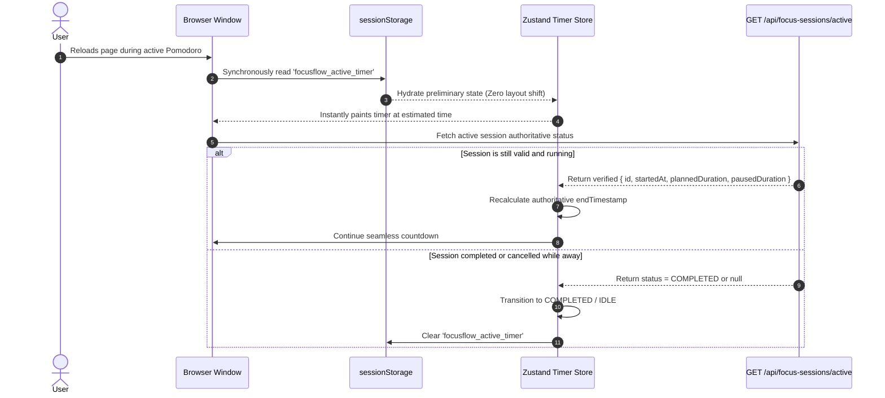

# FocusFlow — State Management Architecture

**Version:** 1.0.0 (Phase 1 — Technical Foundation)  
**Date:** 2026-09-17  
**Status:** Approved Architectural Specification  

---

## 1. State Classification & Taxonomy

To prevent data desynchronization, unnecessary re-renders, and bloated client bundles, FocusFlow rigorously partitions state into four distinct categories. **No single global state store is used for all application concerns.**

```
┌────────────────────────────────────────────────────────────────────────┐
│                        FOCUSFLOW STATE TAXONOMY                        │
├───────────────────┬───────────────────┬─────────────────┬──────────────┤
│ 1. LOCAL UI STATE │ 2. SERVER STATE   │ 3. PERSISTENT   │ 4. TIMER     │
│                   │                   │    DOMAIN STATE │    ENGINE    │
├───────────────────┼───────────────────┼─────────────────┼──────────────┤
│ Scope: Component  │ Scope: Cached API │ Scope: Source of│ Scope: Client│
│ Tool: React Hooks │ Tool: TanStack    │ Truth (DB)      │ Subsystem    │
│ (useState, RHF)   │ Query v5          │ Tool: PostgreSQL│ Tool: Zustand│
│                   │                   │ via Prisma      │ Store        │
└───────────────────┴───────────────────┴─────────────────┴──────────────┘
```

---

## 2. Detailed State Categories

### 2.1 Category 1 — Local UI State
* **Characteristics:** Ephemeral, transient, non-persistent, scoped to a single component or subtree.
* **Technology:** Standard React primitives (`useState`, `useReducer`, `useTransition`) and React Hook Form.
* **Examples:**
  - Modal/Dialog visibility (`isCreateTaskModalOpen`)
  - Active tab selection in settings (`activeTab: 'timer' | 'appearance'`)
  - Form validation states and input dirty states
  - Dropdown open/close state
  - Task filter search query string before debouncing
* **Architectural Rule:** Local UI state must never be hoisted to a global store.

### 2.2 Category 2 — Server State (Asynchronous Cache)
* **Characteristics:** Remote data owned by the PostgreSQL database, cached in the browser for fast UI interaction, subject to background revalidation and optimistic updates.
* **Technology:** **TanStack Query v5** (`@tanstack/react-query`).
* **Responsibilities:**
  - Caching API query results with explicit `staleTime` and `gcTime` policies.
  - Automatic background refetching on window focus (disabled on timer views to preserve battery).
  - Coordinated cache invalidation upon mutations (e.g. creating a task invalidates `['tasks']` and `['projects']`).
  - Optimistic updates for low-latency actions (e.g. toggling task completion).
* **Key Query Keys Hierarchy:**
  ```typescript
  export const queryKeys = {
    user: ['user'] as const,
    settings: ['settings'] as const,
    projects: {
      all: ['projects'] as const,
      detail: (id: string) => ['projects', id] as const,
    },
    tasks: {
      all: ['tasks'] as const,
      filtered: (filters: TaskFilters) => ['tasks', filters] as const,
      detail: (id: string) => ['tasks', id] as const,
    },
    sessions: {
      active: ['sessions', 'active'] as const,
      history: (page: number) => ['sessions', 'history', page] as const,
    },
    analytics: {
      summary: (period: string) => ['analytics', 'summary', period] as const,
      trend: (days: number) => ['analytics', 'trend', days] as const,
      byProject: (period: string) => ['analytics', 'by-project', period] as const,
    },
    goals: ['goals'] as const,
  };
  ```

### 2.3 Category 3 — Persistent Domain State
* **Characteristics:** The authoritative truth of the platform, stored persistently in PostgreSQL and accessed strictly via authenticated API Route Handlers / Server Components.
* **Technology:** PostgreSQL + Prisma ORM.
* **Examples:**
  - User accounts and password hashes
  - Project entities and assignments
  - Task records and completed Pomodoro counters
  - Focus session logs (start time, end time, duration, completion status)
  - User preference configurations
* **Architectural Rule:** Client code never modifies domain state directly; mutations always execute via validated API calls.

### 2.4 Category 4 — Timer Engine State
* **Characteristics:** High-frequency, time-critical state requiring synchronous reads, frame-rate decoupling, cross-tab synchronization, and reload survivability.
* **Technology:** **Zustand** store (`stores/timer-store.ts`) paired with domain calculations.
* **Why Zustand is required here:**
  - A 60fps countdown cannot run through React Context because re-rendering the context provider cascades updates throughout the component tree.
  - Zustand allows **selector-based subscriptions**:
    ```typescript
    // Leaf display component subscribes ONLY to formatted remaining time
    const remainingTime = useTimerStore((s) => s.formattedRemainingTime);
    ```
  - Allows direct updates outside the React render cycle (driven by `requestAnimationFrame`).

---

## 3. Timer State Synchronization Flow

```
┌────────────────────────────────────────────────────────────────────────┐
│                        TIMER RUNTIME PIPELINE                          │
└────────────────────────────────────────────────────────────────────────┘

 [User clicks "Start"]
         │
         ▼
 [POST /api/focus-sessions] ──▶ (Creates IN_PROGRESS record in PostgreSQL)
         │
         ▼ (Receives { id, startedAt, plannedDuration })
 [Zustand Store: START] ──────▶ (Caches session in sessionStorage)
         │
         ├───▶ [BroadcastChannel] ──▶ (Notifies other open tabs)
         │
         ▼
 [RAF Display Loop (~60fps)]
   └── Reads: (endTimestamp - Date.now())
   └── Calculates: remainingMs
   └── Updates: UI Progress Ring + Digits (Zero React Context re-renders!)
         │
         ▼ (remainingMs <= 0)
 [Time Expired Event]
         │
         ├───▶ [Browser Notification + Audio Chime]
         ├───▶ [PATCH /api/focus-sessions/:id (COMPLETED)]
         └───▶ [TanStack Query Invalidation]
                 ├── Invalidate ['sessions']
                 ├── Invalidate ['tasks']
                 ├── Invalidate ['analytics']
                 └── Invalidate ['goals']
```

---

## 4. Rehydration & Refresh Recovery Strategy



---

## 5. Performance Invariants & Anti-Patterns

1. **No Context for High-Frequency Ticks:** Never store countdown seconds or milliseconds in React Context. Context triggers full component tree reconciliation.
2. **Decoupled Animation:** The visual countdown uses `requestAnimationFrame` for rendering, while the domain state only transitions on semantic events (`START`, `PAUSE`, `RESUME`, `EXPIRED`, `RESET`).
3. **Targeted Invalidation:** After completing a focus session, mutate the specific cache keys (`['tasks']`, `['analytics']`) rather than calling a blanket `queryClient.invalidateQueries()`.
4. **No Server State Duplication in Zustand:** Do not mirror task lists or project arrays in Zustand. TanStack Query is the sole manager of asynchronous server state.
